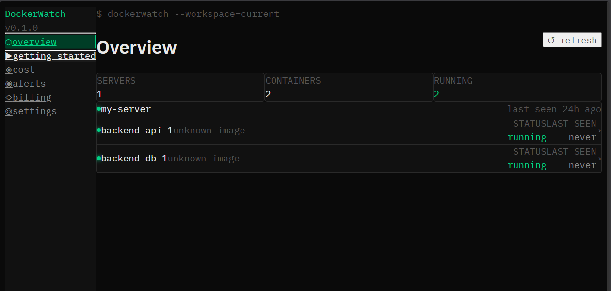
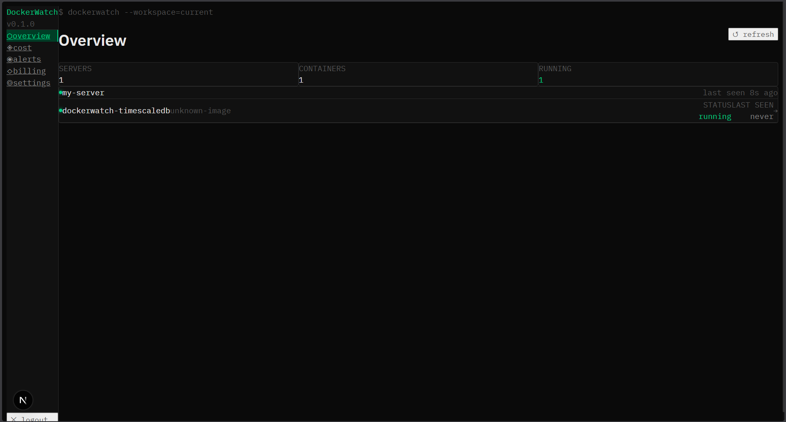
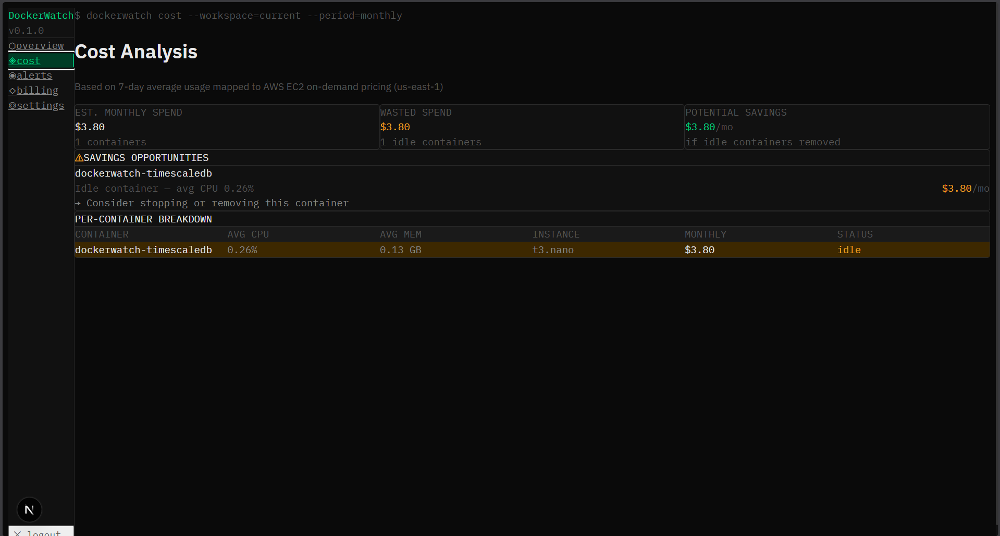
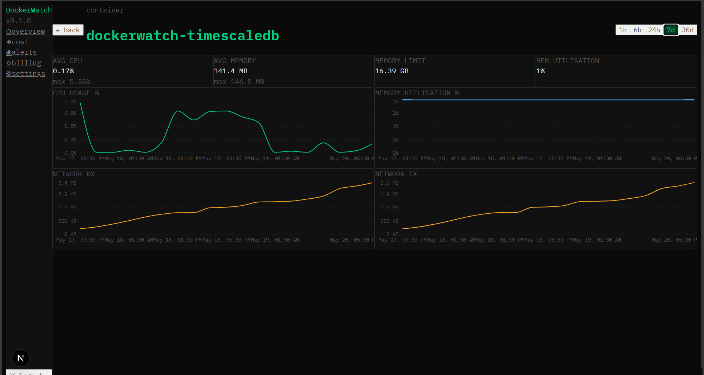
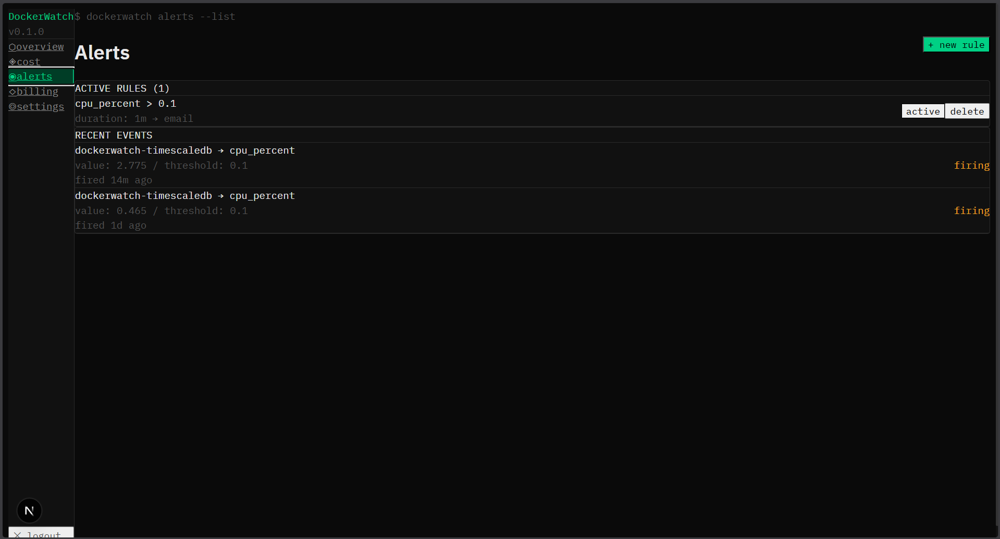

<div align="center">

# 🐳 DockerWatch

**Lightweight container monitoring & cost intelligence for developers**

[](https://pypi.org/project/dockerwatch-agent/)
[](LICENSE)
[](https://python.org)

[**Live Demo**](https://docker-watch.vercel.app) · [**PyPI**](https://pypi.org/project/dockerwatch-agent/) · [**Report Bug**](https://github.com/myselfkunal/dockerwatch/issues) · [**Request Feature**](https://github.com/myselfkunal/dockerwatch/issues)



</div>

---

## The problem

You're running Docker Compose or a handful of containers on a VPS. You have no visibility into which containers are eating resources, which are idle, or what your setup actually costs per month.

**Datadog starts at $300/mo. Setting up Prometheus + Grafana takes half a day.**

DockerWatch fills the gap — a 2-minute install that shows you real-time metrics and tells you exactly which containers are wasting money.

---

## Features

| | |
|---|---|
| **Real-time metrics** | CPU, memory, network I/O, disk I/O per container — every 30 seconds |
| **Cost intelligence** | Maps your usage to AWS EC2 pricing. Shows estimated monthly spend per container. |
| **Idle detection** | Flags containers costing money while doing nothing. Shows exact dollar savings. |
| **Smart alerts** | Threshold-based rules with Slack, email, or webhook delivery |
| **One-line install** | `pip install dockerwatch-agent` — up and running in under 2 minutes |
| **Self-hostable** | Full Docker Compose setup. Run everything on your own infrastructure. |
| **Open source** | MIT licensed. Audit the code, fork it, contribute. |

---

## Quick start

### Hosted (fastest)

1. Sign up at **[docker-watch.vercel.app](https://docker-watch.vercel.app)**
2. Create a workspace → add a server → copy your API key
3. Run on any server with Docker:

```bash
pip install dockerwatch-agent
dockerwatch-agent start --api-key=YOUR_KEY --api-url=https://dockerwatch.mooo.com
```

Your containers appear in the dashboard within 30 seconds. Free tier includes 1 server, 5 containers, and 24h of history — no credit card required.

### Self-hosted

```bash
git clone https://github.com/myselfkunal/dockerwatch.git
cd dockerwatch

# Configure
cp backend/.env.example backend/.env
# Edit backend/.env with your SECRET_KEY and DB settings

# Start backend + database
cd backend
docker compose up -d
alembic upgrade head
uvicorn src.app.main:app --reload

# Start frontend
cd ../frontend
cp .env.example .env.local
# Set NEXT_PUBLIC_API_URL=http://localhost:8000
npm install && npm run dev
```

Open `http://localhost:3000` and follow the getting started guide.

---

## How it works

```
Your server                          DockerWatch
─────────────────────────────────    ──────────────────────────────────
┌──────────────────────────────┐     ┌────────────────────────────────┐
│  Docker daemon               │     │  FastAPI backend               │
│  (your containers)           │     │                                │
│          │                   │     │  ┌──────────────────────────┐  │
│          ▼                   │     │  │  TimescaleDB             │  │
│  ┌───────────────────────┐   │     │  │  (metrics hypertable)    │  │
│  │  dockerwatch-agent    │───┼────▶│  └──────────────────────────┘  │
│  │  polls docker stats   │   │HTTPS│  ┌──────────────────────────┐  │
│  │  every 30 seconds     │   │     │  │  Cost estimation engine  │  │
│  └───────────────────────┘   │     │  │  (AWS EC2 price mapping) │  │
└──────────────────────────────┘     │  └──────────────────────────┘  │
                                     │  ┌──────────────────────────┐  │
                                     │  │  Alert worker            │  │
                                     │  │  (APScheduler, 60s)      │  │
                                     │  └──────────────────────────┘  │
                                     └──────────────┬─────────────────┘
                                                    │ REST API
                                     ┌──────────────▼─────────────────┐
                                     │  Next.js dashboard             │
                                     │  docker-watch.vercel.app       │
                                     │                                │
                                     │  Overview · Cost · Alerts      │
                                     └────────────────────────────────┘
```

The agent is the only component that runs on your servers. It needs read-only access to `/var/run/docker.sock` and outbound HTTPS to the backend. Nothing else.

---

## Screenshots

<table>
  <tr>
    <td><br/><sub>Container overview with live status</sub></td>
    <td><br/><sub>Cost breakdown with savings opportunities</sub></td>
  </tr>
  <tr>
    <td><br/><sub>Time-series charts — CPU, memory, network</sub></td>
    <td><br/><sub>Alert rules with Slack + email delivery</sub></td>
  </tr>
</table>

---

## Tech stack

```
Agent      →  Python 3.11 · Docker SDK · httpx · APScheduler
Backend    →  FastAPI · SQLAlchemy 2.0 (async) · TimescaleDB · Alembic
Frontend   →  Next.js 14 (App Router) · Tailwind CSS · Recharts · shadcn/ui
Alerts     →  APScheduler · Slack webhooks · Resend (email)
Billing    →  Razorpay subscriptions
Infra      →  Azure VPS · Nginx · Let's Encrypt · Vercel · Docker Compose
```

---

## Project structure

```
dockerwatch/
├── agent/                     # Python agent — runs on customer servers
│   └── src/dockerwatch_agent/
│       ├── collector.py       # Docker stats collection + CPU/mem math
│       ├── sender.py          # HTTP client with retry + backoff
│       ├── agent.py           # APScheduler polling loop
│       └── cli.py             # Click CLI entrypoint
│
├── backend/                   # FastAPI backend
│   └── src/app/
│       ├── api/routes/        # auth, workspaces, ingest, metrics, cost, alerts, billing
│       ├── db/                # SQLAlchemy models, Alembic migrations
│       ├── services/          # cost engine, alert worker, Razorpay
│       └── core/              # config, JWT, password hashing
│
├── frontend/                  # Next.js 14 dashboard
│   └── app/
│       ├── dashboard/         # overview, cost, alerts, billing, settings
│       └── auth/              # login, register
│
└── docs/screenshots/          # UI screenshots
```

---

## API reference

Full interactive docs available at `https://dockerwatch.mooo.com/docs` (development) or your self-hosted `/docs` endpoint.

Key endpoints:

```
POST   /auth/register                                    Create account
POST   /auth/login                                       Get JWT token
POST   /ingest                                           Agent → backend (API key auth)
GET    /workspaces/{id}/servers                          List servers + containers
GET    /containers/{id}/metrics?range=1h|6h|24h|7d|30d  Time-series metrics
GET    /workspaces/{id}/cost                             Cost breakdown + savings
POST   /alert-rules/workspaces/{id}/alert-rules          Create alert rule
GET    /alert-rules/workspaces/{id}/alert-events         Alert history
POST   /billing/subscribe                                Start Razorpay subscription
POST   /billing/webhook                                  Razorpay webhook handler
```

---

## Agent installation options

**pip (recommended)**
```bash
pip install dockerwatch-agent
dockerwatch-agent start --api-key=YOUR_KEY --api-url=https://dockerwatch.mooo.com
```

**Docker**
```bash
docker run -d \
  --name dockerwatch-agent \
  -e DOCKERWATCH_API_KEY=YOUR_KEY \
  -e DOCKERWATCH_API_URL=https://dockerwatch.mooo.com \
  -v /var/run/docker.sock:/var/run/docker.sock:ro \
  --restart unless-stopped \
  ghcr.io/myselfkunal/dockerwatch-agent:latest
```

**Docker Compose sidecar**
```yaml
services:
  dockerwatch-agent:
    image: ghcr.io/myselfkunal/dockerwatch-agent:latest
    environment:
      - DOCKERWATCH_API_KEY=YOUR_KEY
      - DOCKERWATCH_API_URL=https://dockerwatch.mooo.com
    volumes:
      - /var/run/docker.sock:/var/run/docker.sock:ro
    restart: unless-stopped
```

**Run in background (no Docker)**
```bash
nohup dockerwatch-agent start --api-key=YOUR_KEY --api-url=https://dockerwatch.mooo.com &
```

---

## Pricing

| Plan | Price | Servers | History | Alerts |
|------|-------|---------|---------|--------|
| Free | ₹0/mo | 1 | 7 days | Email only |
| Pro | ₹999/mo | 5 | 90 days | Slack + email |
| Team | ₹4,100/mo | Unlimited | 1 year | All channels + API |

Paid plans launching soon — [join the waitlist](https://docker-watch.vercel.app/dashboard/billing) for early access + 30 days free.

---

## Roadmap

- [x] Docker Compose monitoring
- [x] Cost estimation engine (AWS EC2 pricing)
- [x] Idle container detection
- [x] Slack + email + webhook alerts
- [x] Razorpay subscription billing
- [x] pip-installable agent on PyPI
- [ ] Kubernetes / pod-level metrics
- [ ] Go rewrite of agent (single binary, zero deps)
- [ ] GCP + Azure + DigitalOcean pricing tables
- [ ] Prometheus `/metrics` export endpoint
- [ ] ARM agent support (Raspberry Pi, Graviton)
- [ ] Weekly cost summary email
- [ ] Mobile app

---

## Contributing

Contributions are welcome. See [CONTRIBUTING.md](CONTRIBUTING.md).

```bash
# Fork + clone
git clone https://github.com/YOUR_USERNAME/dockerwatch.git

# Create branch
git checkout -b feat/your-feature

# Make changes, test locally, open PR against main
```

Areas actively looking for help:
- **Go agent** — single binary, no Python dependency
- **Cloud pricing tables** — GCP, Azure, DigitalOcean in `backend/src/app/services/cost.py`
- **Kubernetes support** — pod metrics via k8s API

---

## License

[MIT](LICENSE) — use it however you want.

---

<div align="center">

Built by [Kunal Shaw](https://github.com/myselfkunal) 

**If DockerWatch saved you money on infra, give it a ⭐**

</div>